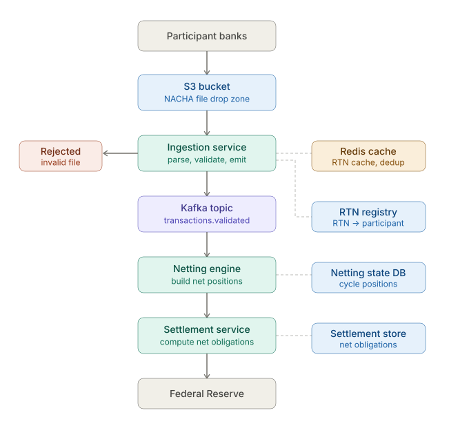
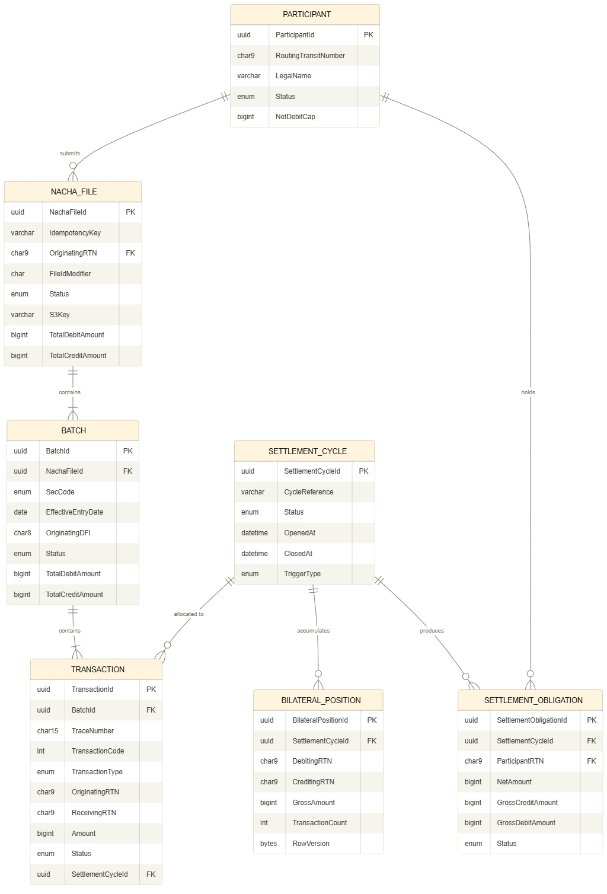
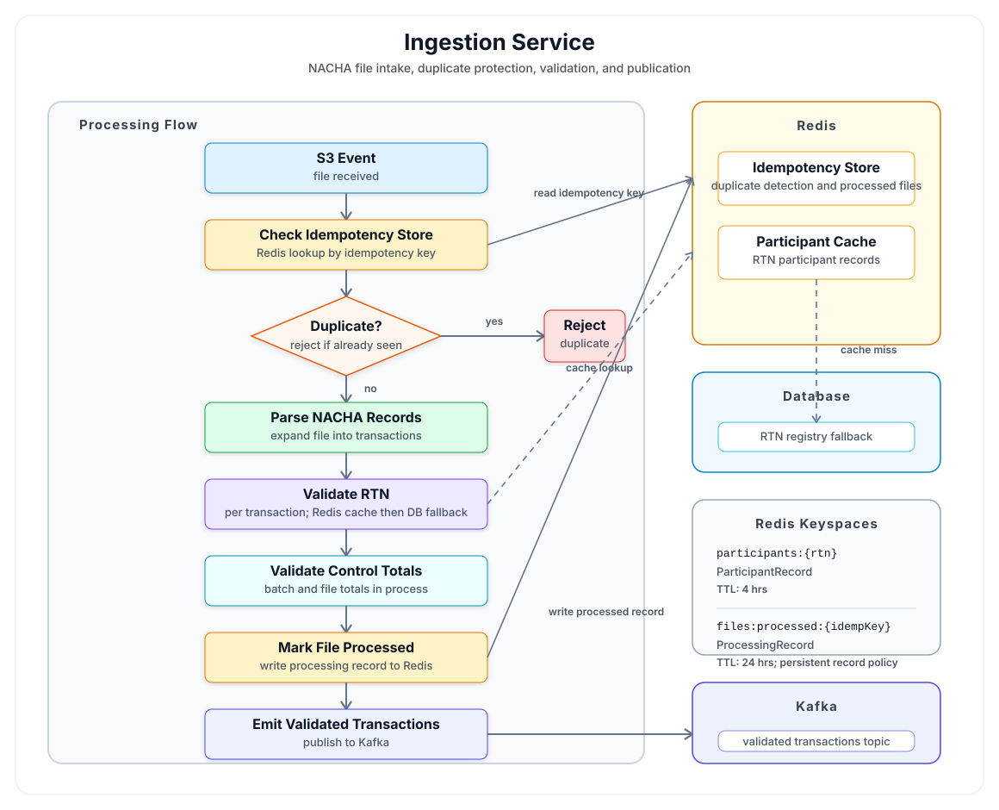

# NetSettlr
A high-throughput, deterministic clearing and settlement engine modeled after traditional automated clearing house (ACH) and deferred net settlement (DNS) systems.

Unlike Real-Time Payments (RTP) that process transactions individually, this platform aggregates, validates, and nets high-volume payment instructions over defined window intervals to minimize systemic liquidity requirements and primarily serves financial institutions, unlike RTP payment processors that can serve retail small money transactions.

Note that RTP can be part of a Clearing and Settlement business solution but still does not serve individual retail customers with their credit/debit card or Zelle/Paypal transactions. Their RTP clients are small businesses and customers expecting real time payments and liquidity. RTP in this sense may also be made in mini-batches and doesn't have to follow a strictly synchronous flow for every single transaction individually.

# Here's the High level Architecture of the System we are going to build

# ERD

# There will be three logical layers in the system

* The Ingestion Layer (S3 -> Ingestion Service) - its job is to ingest (and reject external input), while never letting a malformed or unknown-party transaction into the system.

* The Processing Layer (Kafka -> Netting Engine) is about accumulating state within a settlement cycle — every validated transaction adjusts the running bilateral position between two RTNs (Unique ACH Routing Numbers for source and destination banks). This is where the financial logic lives.

* The Settlement Layer (Settlement Service -> Fed) is a one-way gate - it reads the final netted positions, computes each participant's single net obligation or entitlement (debit/credit), and publishes irrevocable settlement instructions. Once this fires, you cannot undo it.

* We can add a Reconciliation Layer after the Settlement in a future branch to complete the full circle

* This is going to be a living and breathing repo and I have an AI Fraud Detection model (integrates with ingestion layer) and AI embedded features in mind, especially around the API and dashboards

* OpenTelemetry and Observability features will also be built 

* An Event Sourcing system can also be built for auditing, reporting  and compliance purposes

## Ingestion Service Flow

# Key Features
- **Batch Processing**: Aggregates transactions into batches for efficient processing and settlement.
- **Scalability**: Designed to handle high transaction volumes with low latency, making it suitable for large financial institutions.
- **Audit Trail**: Maintains a comprehensive audit trail of all transactions and settlement activities for compliance and regulatory purposes.

